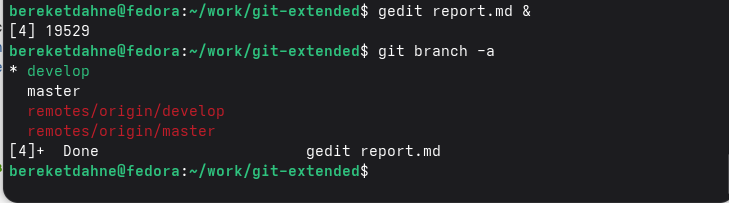
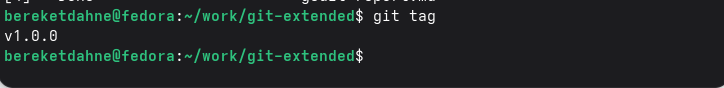
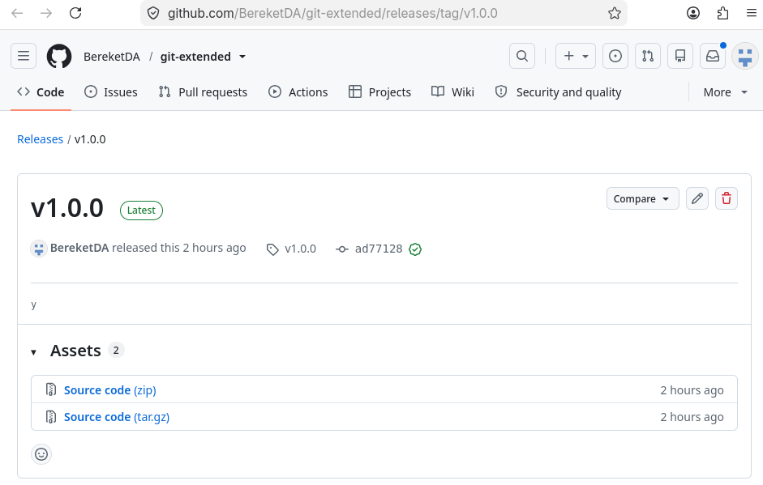

# Лабораторная работа № 4
## Продвинутое использование Git. Gitflow и Conventional Commits

---

### Цель работы
Получение навыков правильной работы с репозиториями git, использование модели ветвления Gitflow и стандарта Conventional Commits.

---

### Задание
1. Установить git-flow, Node.js, pnpm
2. Установить commitizen и standard-changelog
3. Создать репозиторий git-extended
4. Инициализировать git-flow
5. Настроить package.json для commitizen
6. Создать функциональную ветку и добавить файл index.js
7. Завершить функциональную ветку
8. Создать релиз 1.0.0
9. Сгенерировать CHANGELOG.md
10. Опубликовать релиз на GitHub

---

### Выполнение работы

#### 1. Установка программного обеспечения
Были установлены git-flow, Node.js и pnpm:
```bash
sudo dnf copr enable elegos/gitflow
sudo dnf install gitflow -y
sudo dnf install nodejs pnpm -y
pnpm setup
source ~/.bashrc
pnpm add -g commitizen standard-changelog
```

#### 2. Создание репозитория
Был создан репозиторий `git-extended` на GitHub и клонирован локально:
```bash
git clone git@github.com:BereketDA/git-extended.git
cd git-extended
```

#### 3. Инициализация git-flow
```bash
git flow init
```
Были созданы ветки `master` и `develop`.

#### 4. Настройка package.json
```bash
npm init -y
```
В файл `package.json` добавлена конфигурация commitizen:
```json
"config": {
    "commitizen": {
        "path": "cz-conventional-changelog"
    }
}
```

#### 5. Создание функциональной ветки
```bash
git flow feature start feature_branch
```

#### 6. Добавление файла index.js
```bash
echo 'console.log("Hello World!");' > index.js
git add index.js
git commit -m "feat(main): add hello world script"
```

#### 7. Завершение функциональной ветки
```bash
git flow feature finish feature_branch
```

#### 8. Создание релиза
```bash
git flow release start 1.0.0
standard-changelog --first-release
git add CHANGELOG.md
git commit -am 'chore(site): add changelog'
git flow release finish 1.0.0
```

#### 9. Публикация на GitHub
```bash
git push --all
git push --tags
gh release create v1.0.0 -F CHANGELOG.md
```

---

### Результаты

- Репозиторий: https://github.com/BereketDA/git-extended
- Релиз: https://github.com/BereketDA/git-extended/releases/tag/v1.0.0
- Ветки: `master`, `develop`
- Тег: `v1.0.0`
- Файлы: `package.json`, `index.js`, `CHANGELOG.md`

**Скриншот 1:** Ветки репозитория


**Скриншот 2:** Теги


**Скриншот 3:** Релиз на GitHub


---

### Ответы на контрольные вопросы

**1. Что такое Gitflow?**

Gitflow — это модель ветвления для управления релизами. Используются ветки:
- `master` — production
- `develop` — разработка
- `feature/*` — новые функции
- `release/*` — подготовка релиза
- `hotfix/*` — срочные исправления

**2. Что такое Conventional Commits?**

Conventional Commits — это стандарт для написания сообщений коммитов. Основные типы:
- `feat`: новая функция
- `fix`: исправление ошибки
- `chore`: вспомогательные задачи
- `docs`: изменения в документации
- `refactor`: рефакторинг кода
- `test`: изменения в тестах

**3. Что такое семантическое версионирование?**

Семантическое версионирование — это подход к нумерации версий в формате `МАЖОРНАЯ.МИНОРНАЯ.ПАТЧ`:
- МАЖОРНАЯ — несовместимые изменения API
- МИНОРНАЯ — добавление функциональности (обратно совместимо)
- ПАТЧ — исправления ошибок (обратно совместимо)

**4. Какие инструменты используются для автоматизации релизов?**

Используются `commitizen` для форматирования коммитов и `standard-changelog` для генерации журнала изменений.

**5. Как опубликовать релиз на GitHub?**

После создания тега используется команда:
```bash
gh release create v1.0.0 -F CHANGELOG.md
```

---

### Выводы

В ходе выполнения лабораторной работы № 4 я освоил:

1. Модель ветвления Gitflow для управления релизами
2. Стандарт Conventional Commits для написания сообщений коммитов
3. Использование инструментов commitizen и standard-changelog
4. Создание и публикацию релизов на GitHub
5. Семантическое версионирование

Таким образом, цель работы — получение навыков правильной работы с репозиториями git — была полностью достигнута.

